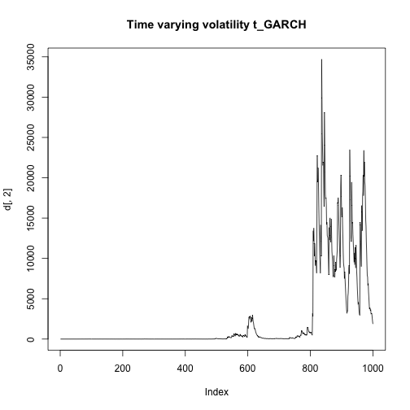
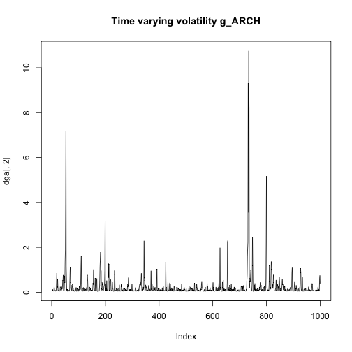

HOMEWORK 4 EXERCISE 2


a)

```r
library(metRology)
```

```
## 
## Attaching package: 'metRology'
```

```
## The following objects are masked from 'package:base':
## 
##     cbind, rbind
```

```r
library(e1071)
tGARCH= function(n,omega,alpha,beta,nu){
  z=rt.scaled(n, nu, mean = 0, sd = 1)
  y=rep(0,n)
  sigma=rep(0,n)
  sigma[1]=omega
  y[1]=sqrt(omega)*z[1]
  for(t in 2:n){
    sigma[t]= omega+alpha*(y[t-1])^2+beta*sigma[t-1]
    y[t]=sqrt(sigma[t])*z[t]
  }
  result=cbind(y,sigma)

}

d<-tGARCH(1000,0.05,0.1,0.85,4)
```


b)

```r
plot(d[,1],type="l",main="yt t_GARCH")
```


```r
plot(d[,2],type="l",main="Time varying volatility t_GARCH")
```




c)

```r
y<-d[,1]
mean(y)
```

```
## [1] 0.1367977
```

```r
var(y)
```

```
## [1] 3666.289
```

```r
skewness(y)
```

```
## [1] 0.5439049
```

```r
kurtosis(y)
```

```
## [1] 16.06455
```


d)

```r
acf(y,200)
```


```r
pacf(y,200)
```


```r
acf(abs(y))
```


```r
acf(y^2)
```


```r
pacf(y^2)
```


e)

```r
gGARCH= function(n,omega,alpha,beta){

  z=rnorm(n,mean=0,sd=1)
  y=rep(0,n)
  sigma=rep(0,n)
  sigma[1]=omega
  y[1]=sqrt(omega)*z[1]
  for(t in 2:n){
    sigma[t]= omega+alpha*(y[t-1])^2+beta*sigma[t-1]
    y[t]=sqrt(sigma[t])*z[t]
  }
  result=cbind(y,sigma)
  
}

dt<-tGARCH(1000,0.05,0.1,0.85,4)
dg<-gGARCH(1000,0.05,0.1,0.85)

plot(dt[,2],type="l",main="Time varying volatility t_GARCH")
```


```r
plot(dg[,2],type="l",main="Time varying volatility g_GARCH")
```


```r
plot(dt[,1],type="l",main = "Estimated yt t_Garch")
```


```r
plot(dg[,1],type="l",main = "Estimated yt g_Garch")
```


As we can see the estimated time varying volatility explodes in the case of the t_GARCH because it's very sensitive to outliers, overpredicting the real values.
The same happens for the estimated values of yt


f)

```r
gARCH= function(n,omega,alpha){
 
  z=rnorm(n,mean=0,sd=1)
  y=rep(0,n)
  sigma=rep(0,n)
  sigma[1]=omega
  y[1]=sqrt(omega)*z[1]
  for(t in 2:n){
    sigma[t]= omega+alpha*(y[t-1])^2
    y[t]=sqrt(sigma[t])*z[t]
  }
  result=cbind(y,sigma)
  
}
dg<-gGARCH(1000,0.05,0.1,0.85)
dga<-gARCH(1000,0.05,0.85)


plot(dga[,2],type="l",main="Time varying volatility g_ARCH")
```



```r
plot(dg[,2],type="l",main="Time varying volatility g_GARCH")
```


```r
plot(dga[,1],type="l",main="Estimated yt g_ARCH")
```


```r
plot(dg[,1],type="l",main="Estimated yt g_GARCH")
```


In this case we get more similar results, the estimated time varying volatility and yt don't seem to explode

HOMEWORK 5 EXERCISE 2


a)

```r
tDCS=function(d,chi,k,nu,lamda,n){
  mu=rep(0,n)
  u=rep(0,n)
  y=rt(n,nu)
  v=rep(0,n)
  mu[1]=d
  
  for(t in 1:n){
    
    v[t]=y[t]-mu[t]
    u[t]=(v[t]/(1+(v[t]^2)/(nu*exp(2*lamda))))
    mu[t+1]=d+ chi*mu[t]+ k*u[t]
  }
  result=list("y"=y,"u"=u,"mean"=mu,"v"=v)
  return(result)
}

sim<-tDCS(0.05,0.2,0.01,200,0,10000)

plot(sim$y,sim$u,pch=20,ylim=c(-5,5),cex=0.5,col="black",main="DCS-t-location model")
sim<-tDCS(0.05,0.2,0.01,10,0,10000)
points(sim$y,sim$u,col="blue",pch=20,cex=0.5)
sim<-tDCS(0.05,0.2,0.01,3,0,10000)
points(sim$y,sim$u,col="red",pch=20,cex=0.5)
legend("topleft", pch=20,legend = c("nu=200","nu=10","nu=3"),col=c("black","blue","red"))
```


As we can see for nu that goes to infinity ut=vt so it becomes linearly related to yt. When nu takes small values the outlier values of yt are in some sense downweighted in order to obtain robust estimates.


b)

```r
beta_tGARCH=function(d,chi,k,nu,n){
  z=rt.scaled(n, nu, mean = 0, sd = 1)
  sigma=rep(0,n)
  y=rep(0,n)
  u=rep(0,n)
  sigma[1]=d
  for(t in 1:n){
    sigma[t+1]=d+chi*sigma[t]+k*sigma[t]*u[t]
    y[t]=sqrt(sigma[t])*z[t]
    u[t]=(((nu+1)*y[t]^2)/((nu-2)*sigma[t]+y[t]^2))-1
  }
  result= list("y"=y,"u"=u)
  return(result)
  
}

sim<-beta_tGARCH(0.05,0.85,0.01,200,10000)
plot(sim$y,sim$u,pch=20,cex=0.5,col="black",main="Beta-t-GARCH",ylim=c(-2,10),xlim=c(-5,5))
sim<-beta_tGARCH(0.05,0.85,0.01,10,10000)
points(sim$y,sim$u,col="blue",pch=20,cex=0.5)
sim<-beta_tGARCH(0.05,0.85,0.01,3,10000)
points(sim$y,sim$u,col="red",pch=20,cex=0.5)
legend(-5,2, pch=20,legend = c("nu=200","nu=10","nu=3"),col=c("black","blue","red"))
```


As we can see also in this case the extreme values of yt are downweighted when the value of nu is small


```r
beta_tEGARCH=function(d,chi,k,nu,n){
  z=rt.scaled(n, nu, mean = 0, sd = 1)
  lamda=rep(0,n)
  y=rep(0,n)
  u=rep(0,n)
  lamda[1]=d
  for(t in 1:n){
    lamda[t+1]=d+chi*lamda[t]+k*u[t]
    y[t]=exp(lamda[t])*z[t]
    u[t]=(((nu+1)*y[t]^2)/(nu*exp(2*lamda[t])+y[t]^2))-1
  }
  result= list("y"=y,"u"=u)
  return(result)
  
}

sim<-beta_tEGARCH(0.05,0.85,0.01,200,10000)
plot(sim$y,sim$u,pch=20,cex=0.5,col="black",main="Beta-t-EGARCH",ylim=c(-3,10),xlim=c(-10,10))
sim<-beta_tEGARCH(0.05,0.85,0.01,10,10000)
points(sim$y,sim$u,col="blue",pch=20,cex=0.5)
sim<-beta_tEGARCH(0.05,0.85,0.01,3,10000)
points(sim$y,sim$u,col="red",pch=20,cex=0.5)
legend(-10,1, pch=20,legend = c("nu=200","nu=10","nu=3"),col=c("black","blue","red"))
```


We get very similar results in comparison with Beta-t-GARCH, but in this case the curves seem to be tighter


EXERCISE 3

```r
set.seed(123)
sim<-tDCS(0.05,0.85,0.5,3,0,100)
plot(sim$y,type="l",ylim=c(-15,15),main = "DCS-t location model ")
lines(sim$mean,col="red")
legend(0,-6,legend=c("yt","mean"),col=c("black","red",3),lty=1)
```


The value of the the time varying mean at time t depends on information at time t-1, for this reason on the graph it appears to be shifted ahead by 1 lag


```r
plot(sim$v,type = "l",ylim=c(-15,15), main="DCS-t location model ")
lines(sim$u,type = "l",col="red")
lines(sim$y,type="l",col=3)
legend(0,-6,legend=c("vt","ut","yt"),col=c("black","red",3),lty=1)
```


As we can see ut seems to be more robust against the shocks of yt compared to vt


```r
acf(y)
```


```r
acf(sim$u)
```


```r
acf(sim$v)
```


As we can see the autocorrelation function never seems to be significative
